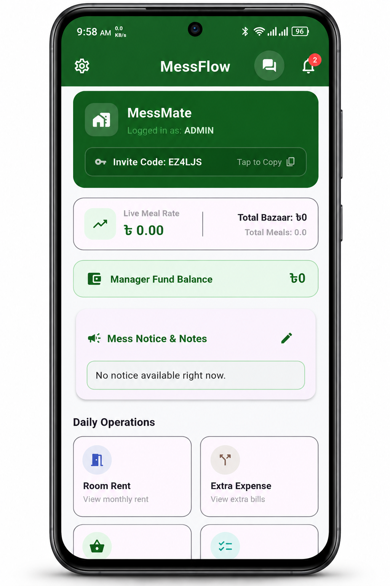
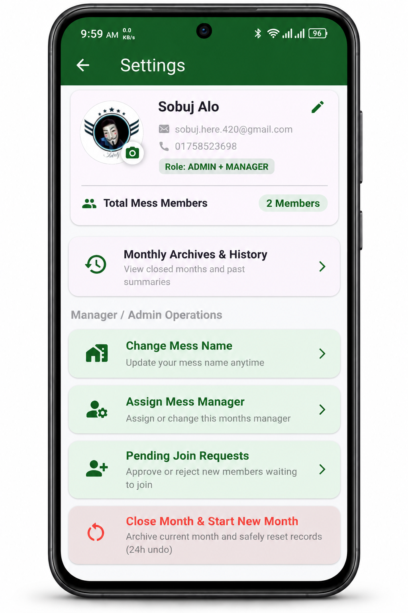
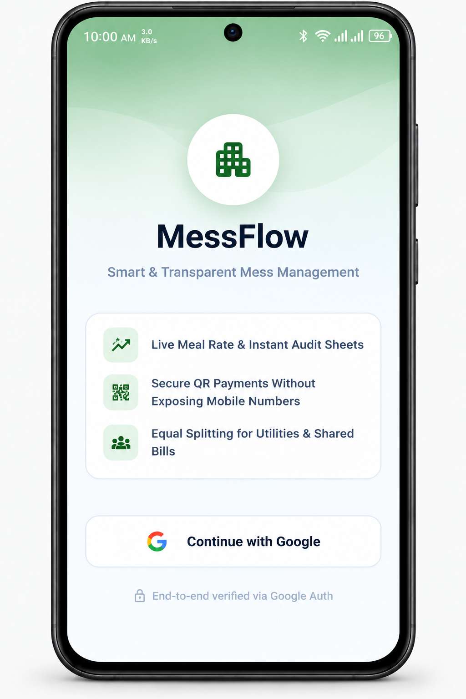
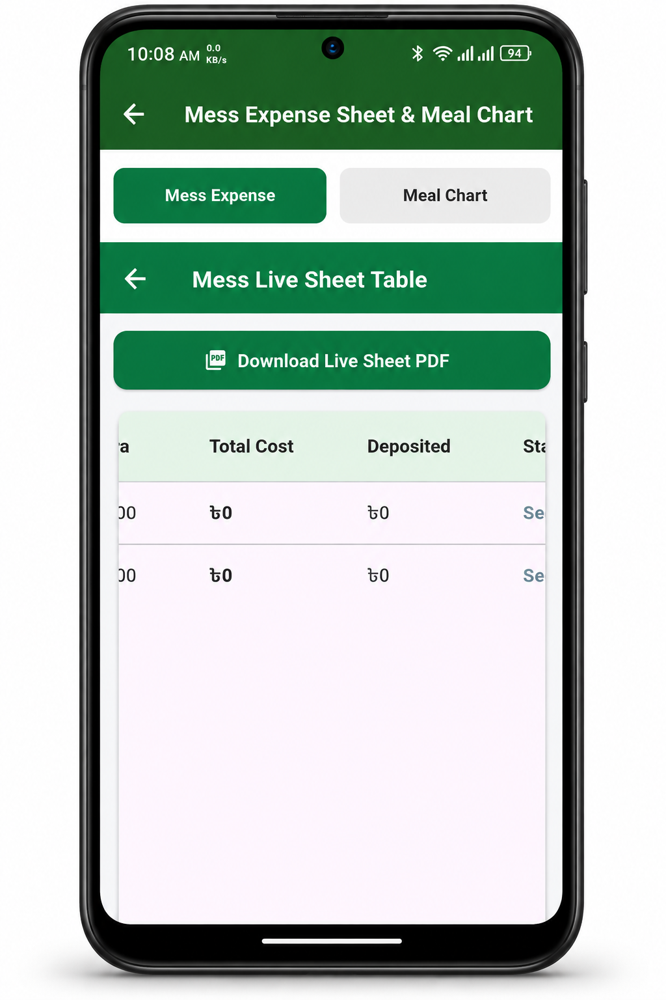

# 🚀 MessFlow — Smart Mess Management Application

**MessFlow** is a modern, feature-rich **Flutter-based mobile application** designed to simplify and automate day-to-day mess management operations.

It eliminates the hassle of manual calculations by providing a centralized platform to manage **daily meals, bazaar expenses, shared costs, member deposits, room rents, utilities, and monthly financial records** in real time.

---
## 📥 Download MessFlow

Download the latest version of **MessFlow** for Android.

> [!NOTE]
> Download and install the latest APK to access the newest features and improvements.

---
## 📱 App Screenshots

  
  

  
  

## 🌟 Key Features & Modules

### 🏠 Live Mess Sheet & Dashboard

- Real-time overview of **total bazaar costs, approved bazaar lists, total meals, and dynamic meal-rate calculations**.
- Quick summary cards for monitoring the overall financial status of the mess at a glance.

### 🍲 Daily Meal Management

- Seamless tracking of **breakfast, lunch, and dinner** for individual members.
- Detailed monthly meal charts and daily meal-entry records.
- Easy access to historical meal information.

### 💰 Payments & Funds Tracker

- Accurately track **member deposits, advance payments, and outstanding dues**.
- Automated balance calculations for each member.
- Clearly distinguishes between **Refunds and Dues** at the end of each calculation cycle.

### 🛒 Shared Assets & Extra Expenses

- Manage shared expenses such as **utility bills, Wi-Fi, cleaning charges, furniture, and other common assets**.
- Expenses can be distributed **equally or selectively** among active mess members.

### 🏢 Room Rent & Utilities

- Dedicated management for **individual room rents and utility payments**.
- Transparent summary tables for easier financial tracking.
- Helps avoid unnecessary confusion caused by zero-value or irrelevant entries.

### 📚 Monthly Archives & History

- Securely archive completed months using **Firebase Firestore**.
- View previous months with detailed tabular records, including:
  - Expense sheets
  - Meal charts
  - Room-rent summaries
- Includes a **24-hour undo window** for recently archived records.
- Secure trash management for deleted archive records.

### 🌐 Multi-Language Support

- Fully localized user interface.
- Supports dynamic switching between **English and Bengali (বাংলা)**.

### 🛡️ Role-Based Access Control (RBAC)

- Secure administrative and managerial controls.
- Restricted operations are available only to authorized **Admins and Managers**.
- Protected actions include:
  - Closing monthly records
  - Resetting data
  - Deleting archives

---

## 🛠️ Technology Stack

| Category | Technology |
|---|---|
| 📱 Frontend | Flutter (Dart) |
| 🔥 Backend & Database | Firebase Firestore |
| 🔐 Authentication | Firebase Authentication |
| ⚡ State Management | ListenableBuilder |
| 🧩 Architecture | Stateful & Stateless Widgets |

---

## 🎯 Project Goal

MessFlow aims to provide a **simple, transparent, and efficient digital solution for everyday mess management**, reducing manual calculations while making meals, expenses, payments, and monthly records easier to manage.

---

## 🚧 Project Status

**Active Development**

More features, improvements, and optimizations will be introduced in future releases.
